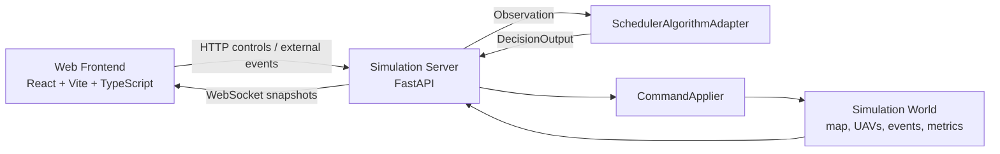
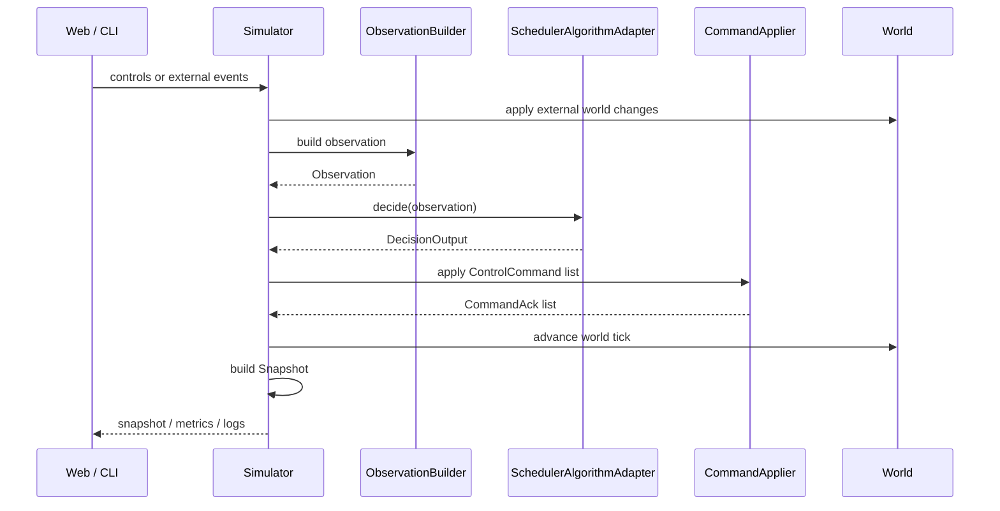

# Algorithm / Simulation / Web Split Design

## Status

Draft for the first architecture split milestone. The first implementation phase keeps the algorithm model in the same Python process as the simulator. The goal is to make the interface boundary explicit before moving the algorithm behind a separate service.

Phase 1 implementation scope is limited to Migration Plan steps 0-5: freeze baseline, add contracts, add `ObservationBuilder`, add `SchedulerAlgorithmAdapter`, add `CommandApplier`, and refactor the simulator tick loop. FastAPI, WebSocket, and Web MVP work must wait until these steps pass the old CLI scenarios and the target confirmation scenario.

Phase 0.5b boundary hardening is implemented in-process. The CLI now enters the first decision through `Simulator.run_initial_decision()`, scenario events enter through the simulator event queue, `ObservationBuilder` lives under `uav_search/simulation`, and `contracts.py` stays free of map and fleet imports. `SchedulerAlgorithmAdapter` consumes recent `CommandAck` records before deciding, `CommandApplier` owns path installation and UAV execution state, and `Scheduler` no longer calls `fleet.assign_path` or writes real UAV execution fields directly. `MAP_UPDATE`, `UAV_OFFLINE`, and `UAV_RECOVERED` are applied by the simulator before the observation is built. `CONFLICT_YIELD` is logged as an advisory no-op in phase 1 unless metadata explicitly marks it as a physical path change.

## Goals

- Keep the current map, A*, simulation, event, metrics, search scheduling, and target confirmation behavior usable from the existing CLI.
- Separate decision-making from physical world execution:
  - Simulation owns world state, UAV motion, sensor coverage, dynamic obstacles, target discovery, command execution, and command acknowledgements.
  - Algorithm owns search tasks, confirmation tasks, task allocation, replanning decisions, and task summaries.
- Introduce stable contracts for `Observation`, `ControlCommand`, `DecisionOutput`, `Snapshot`, `CommandAck`, and `MissionSpec`.
- Make commands executable by the simulator. High-level scheduler intent may be preserved as metadata, but the command itself must be something the simulator can apply.
- Prepare a simple Web MVP that displays state and injects external events without importing or calling scheduler, map, or fleet internals.

## Non-Goals

- Do not move the algorithm into an HTTP service in phase 1.
- Do not replace the current scheduler, A*, map, simulation, metrics, or event modules.
- Do not introduce a GIS framework for the first Web MVP.
- Do not reimplement algorithm task management inside the Simulation Server.
- Do not add strike or target attack logic.

## Frozen Baseline

Before changing architecture, freeze a behavior baseline from the current code:

- Basic search scenarios: `area_search_1uav`, `area_search_2uav`, `area_search_3uav`, `area_search_4uav`, `area_search_5uav`.
- Target confirmation scenario: `area_search_2uav_target_confirm`.
- Metrics must include:
  - `target_found_count`
  - `coverage_gap_at_confirm_done`
  - `target_response_time_s`
  - `target_confirm_duration_s`
  - `confirm_success_rate`
  - `search_resume_delay_s`
  - `interrupted_task_resume_rate`
  - `turn_rate`
  - `replan_count`
  - `coverage_gain_per_meter`
  - `post_95_extra_distance_m`
  - `per_uav_workload_balance`
- Snapshots must include:
  - algorithm output `commands`
  - task status summary
  - target metrics

The first split milestone is accepted only if old CLI scenarios still run and their metrics remain within an agreed tolerance.

## Target Architecture



### Web Frontend

The Web frontend displays the map, UAV trajectories, coverage, events, command logs, task summaries, and metrics. The first version should use Canvas or SVG drawing, not a complex GIS framework.

The Web frontend may call only public server APIs. It must not call `scheduler.xxx()`, `grid_map.xxx()`, or `fleet.xxx()` directly.

Supported external controls and events:

- `RESET`
- `START`
- `PAUSE`
- `STEP`
- `ADD_OBSTACLE`
- `REMOVE_OBSTACLE`
- `TARGET_FOUND`
- `UAV_OFFLINE`
- `UAV_RECOVERED`

### Simulation Server

The Simulation Server owns the physical simulation and exposes:

- HTTP controls:
  - `reset`
  - `start`
  - `pause`
  - `step`
  - `event`
  - `state`
  - `metrics`
- WebSocket stream:
  - periodic snapshots
  - command acknowledgements
  - event log updates

The server converts Web requests into external events or simulation controls. It does not expose internal scheduler, map, or fleet objects.

### Algorithm Model

In phase 1, the algorithm remains an in-process Python object behind an adapter. It does not know that a Web page exists and does not mutate simulator objects directly.

The algorithm receives:

- mission spec
- current observation
- recent command acknowledgements
- external events already normalized by the simulator

The algorithm returns:

- executable control commands
- optional intents and metadata
- task summary for display
- target summary for display

## Ownership Boundaries

| Area | Simulation Server | Algorithm Model |
| --- | --- | --- |
| Physical UAV position | Owns | Observes |
| Battery consumption | Owns | Uses for decisions |
| Sensor coverage application | Owns | Observes coverage state |
| Dynamic obstacle mutation | Owns | Observes changed cells |
| Event ingestion | Owns normalization | Decides response |
| Search task state | Displays summary only | Owns |
| Confirm task state | Displays summary only | Owns |
| Path execution | Owns | Requests via commands |
| A* planning | May validate executability | Uses for decision planning |
| Command lifecycle | Owns ack status | Reacts to acks |
| Metrics | Owns recorded metrics | Provides decision metadata |

## Phase 1 Tick Flow



Recommended order inside a tick:

1. Normalize external events.
2. Apply immediate world events such as added obstacles or UAV failures.
3. Build an `Observation`.
4. Call `algorithm.decide(observation)`.
5. Apply returned `ControlCommand` objects through `CommandApplier`.
6. Advance UAV motion and sensor coverage.
7. Record command acknowledgements and metrics.
8. Build and publish a `Snapshot`.

## Data Contracts

The contracts should live in a new small module, for example `uav_search/contracts.py` or `uav_search/core/contracts.py`. They should be plain dataclasses or typed models with no dependency on Web frameworks.

### MissionSpec

`MissionSpec` describes static or slowly changing mission configuration:

- map dimensions
- resolution
- initial UAV specs
- sensor radius
- coverage thresholds
- priority area definitions
- battery and return-home policy
- scenario metadata

### Observation

`Observation` is the only world input the algorithm needs per tick:

- `tick`
- `time_s`
- `mission_id`
- `map`
- `changed_cells`
- `uavs`
- `coverage`
- `events`
- `command_acks`
- `metrics_hint`

For phase 1, map observation sends the complete map arrays plus `changed_cells`. The current maps are small enough, and full arrays make debugging and replay easier. Later phases can optimize to incremental map patches.

### UAVObservation

Each UAV observation should include:

- `uav_id`
- `position`
- `status`
- `battery`
- `home`
- `current_command_id`
- `current_task_id`
- `remaining_path`
- `last_error`

### EventObservation

External and simulated events should be normalized before reaching the algorithm:

- `event_id`
- `event_type`
- `time_s`
- `source_uav_id`
- `data`

For `TARGET_FOUND`, `source_uav_id` may be empty. The algorithm must choose a confirmer by cost, not by source alone.

### ControlCommand

`ControlCommand` is the executable command name used at the boundary. It can wrap or adapt the existing internal `DecisionCommand` initially, so the first implementation does not require a broad rename.

Required fields:

- `command_id`
- `command`
- `uav_id`
- `path`
- `target`
- `task_id`
- `reason`
- `issued_at`
- `ttl_s`
- `metadata`

Executable command types for phase 1:

- `FOLLOW_PATH`
- `CONFIRM_TARGET`
- `RETURN_HOME`
- `HOLD`
- `CANCEL_COMMAND`

`CANCEL_COMMAND` semantics:

- If `metadata.command_id` exists, cancel that specific command.
- If `metadata.command_id` is absent, cancel the UAV's current active command.
- The simulator must emit a `cancelled` acknowledgement.
- The algorithm decides whether to reassign work after it receives the acknowledgement.

High-level decisions such as `ASSIGN_SEARCH_TASK` may appear as `intent` or `metadata`, but the simulator should execute one of the concrete command types above.

### DecisionOutput

`DecisionOutput` is returned by the algorithm:

- `commands`
- `task_summary`
- `target_summary`
- `metrics_updates`
- `debug`

It should be legal for the algorithm to return no command on a tick.

### CommandAck

The simulator reports command lifecycle through acknowledgements:

```python
@dataclass(frozen=True)
class CommandAck:
    command_id: str
    uav_id: str
    status: str  # accepted/running/completed/failed/rejected/cancelled
    reason: str | None = None
    progress: float | None = None
```

Acknowledgement statuses:

- `accepted`: command was accepted and assigned.
- `running`: command is still executing.
- `completed`: command finished successfully.
- `failed`: command started but could not complete.
- `rejected`: command could not be accepted.
- `cancelled`: command was cancelled by a later command or event.

The next `Observation` must include recent command acknowledgements. This is especially important for target confirmation. If `CONFIRM_TARGET` is rejected because the path is unreachable or the UAV lacks battery, the algorithm needs that ack to reassign the task or mark confirmation failed.

Phase 1 acknowledgement retention:

- Carry the most recent 200 acknowledgements or the acknowledgements from the last 30 seconds, whichever is smaller.
- Each UAV must keep at least the latest acknowledgement for its active command.

### Snapshot

`Snapshot` is for replay, Web display, and CLI artifacts:

- `tick`
- `time_s`
- `map`
- `uavs`
- `coverage`
- `events`
- `commands`
- `command_acks`
- `tasks`
- `targets`
- `metrics`

Snapshots should remain append-only during a run. Web clients should be able to reconstruct the visible state from snapshots without calling algorithm internals.

Phase 1 replay policy stores a complete snapshot every tick. This favors debugging and replay clarity over storage optimization.

## CommandApplier

`CommandApplier` is the most important extraction in the first implementation. It is the object that turns algorithm commands into simulator state changes and command acknowledgements.

Responsibilities:

- Validate command shape and target UAV existence.
- Reject commands for offline UAVs.
- Reject or fail commands that cannot be executed safely.
- Install executable paths onto UAVs.
- Track active command per UAV.
- Mark progress, completion, failure, cancellation, and rejection.
- Clear stale paths when a command fails.
- Preserve enough command metadata for snapshots and metrics.

`CommandApplier` should not decide which UAV should search or confirm a target. It only decides whether a command is executable in the current world.

## SchedulerAlgorithmAdapter

`SchedulerAlgorithmAdapter` wraps the current scheduler behind the new algorithm interface.

Initial responsibilities:

- Convert `Observation` into the view expected by the existing scheduler.
- Call the existing scheduling logic.
- Convert existing `DecisionCommand` output into `ControlCommand`.
- Include scheduler task and target summaries in `DecisionOutput`.
- Feed recent `CommandAck` values back into scheduler state where needed.

The adapter must hold and reuse one legacy `Scheduler` instance for the whole run. It must not rebuild `Scheduler` or `TaskManager` every tick. `Observation` is for synchronizing external world state, events, and command acknowledgements.

This adapter lets the project introduce the boundary without rewriting the scheduler in the same step.

## Migration Plan

### 0. Freeze Current Baseline

- Run basic search scenarios and target confirmation scenario.
- Keep current metrics and snapshots as the reference output.
- Store baseline output under a dedicated run directory.

### 1. Add Contracts

- Add dataclasses for `MissionSpec`, `Observation`, `ControlCommand`, `DecisionOutput`, `CommandAck`, and `Snapshot`.
- Keep the dataclasses independent of FastAPI and frontend code.
- Add serialization helpers only where needed for JSON snapshots and WebSocket output.

### 2. Add ObservationBuilder

- Build `Observation` from current simulator state.
- Include full map arrays and `changed_cells`.
- Include normalized events and recent command acknowledgements.
- Add focused tests for map updates, target events with no source UAV, and offline UAVs.

### 3. Add SchedulerAlgorithmAdapter

- Wrap the current scheduler.
- Preserve current CLI behavior.
- Convert legacy command output to `ControlCommand`.
- Return task and target summaries for snapshots.

### 4. Add CommandApplier

- Move command execution and command lifecycle handling out of scheduler-facing code.
- Produce `CommandAck` records.
- Keep path following, confirm target execution, return-home, hold, and cancellation behavior testable in isolation.
- First implementation must not rewrite the UAV movement model or path execution. It should concentrate existing command application behavior while preserving legacy CLI behavior.

### 5. Refactor Simulator Tick Loop

Target loop:

```text
build_observation
algorithm.decide
apply_commands
world.step
build_snapshot
```

The old CLI should use the same loop as the future server.

### 6. Add Simulation Server

- Use FastAPI for HTTP controls.
- Use WebSocket to push snapshots.
- Keep algorithm in-process for phase 1.
- Convert Web requests into external events or simulation controls.

### 7. Add Web MVP

- Use React + Vite + TypeScript.
- Draw map and UAV state with Canvas or SVG.
- Show command log, event log, task summary, and metrics.
- Support start, pause, step, reset, obstacle edits, target injection, and UAV failure/recovery.

## Testing Strategy

### Contract Tests

- JSON serialization round trip.
- Optional fields remain optional.
- Unknown metadata does not break consumers.

### ObservationBuilder Tests

- Full map arrays match simulator state.
- `changed_cells` is populated after dynamic obstacle changes.
- `TARGET_FOUND` with empty `source_uav_id` reaches the algorithm.
- UAV offline and recovery events appear correctly.

### SchedulerAlgorithmAdapter Tests

- Existing scenarios produce equivalent command intent.
- Target confirmation still selects a UAV when `source_uav_id` is empty.
- Repeated target reports do not duplicate confirmation tasks.

### CommandApplier Tests

- `FOLLOW_PATH` installs a path and produces `accepted`, `running`, and `completed`.
- `CONFIRM_TARGET` rejects unreachable confirmation paths without leaving the UAV stuck.
- `RETURN_HOME` validates battery and reachability.
- `HOLD` clears active motion safely.
- `CANCEL_COMMAND` cancels active commands and emits `cancelled`.
- Offline UAV commands are rejected.

### End-to-End Tests

- Existing CLI scenarios still reach the configured coverage threshold.
- Target confirmation scenario still confirms the target and resumes search.
- Snapshots still contain commands, tasks, targets, and metrics.
- Baseline metrics remain within tolerance.

### Web Smoke Tests

- HTTP reset/start/pause/step works.
- WebSocket receives snapshots.
- Injected obstacle changes the map and reaches the next observation.
- Injected target produces a confirmation command or failure ack.

## Acceptance Criteria For First Split Milestone

- Old CLI scenarios still run through the new loop.
- `area_search_2uav_target_confirm` still produces one target found event and a successful confirmation when the target is reachable.
- Coverage remains at or above the configured mission threshold for basic scenarios.
- `time_to_95_coverage_s` does not exceed the frozen baseline by more than 15%.
- `total_distance_m` does not exceed the frozen baseline by more than 15%.
- `confirm_success_rate` remains `1.0` for the target confirmation scenario.
- `interrupted_task_resume_rate` remains `1.0` for the target confirmation scenario.
- `no_fly_violations` remains `0`.
- Snapshots include `commands`, `command_acks`, `tasks`, `targets`, and metrics.
- The algorithm can be called through `SchedulerAlgorithmAdapter.decide(observation)`.
- The simulator applies commands only through `CommandApplier`.
- Web-facing code does not import scheduler, map, or fleet internals.

## Open Questions

- How many historical `CommandAck` records should each observation carry?
- Should map arrays be encoded as nested lists, compact run-length rows, or NumPy-friendly binary payloads for the WebSocket path?
- Should replay files store every full snapshot, or periodic full snapshots plus deltas?
- How many simultaneous algorithm instances should the server support in later service mode?
